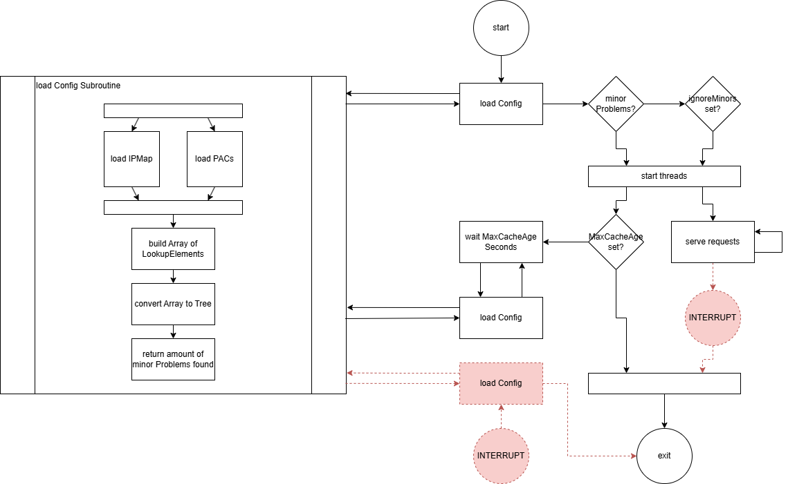

# PAC-Server

This is a custom server made to serve Proxy Auto Config (short PAC) Files based on Source IP. It allows organizations to automatically provide the correct proxy configuration to clients based on their network location.

## What is PAC-Server?

PAC-Server is a specialized web server that:
- Serves different Proxy Auto-Configuration (PAC) files based on the client's source IP address
- Maps IP networks to specific PAC files using a configurable zone mapping
- Supports templating in PAC files for dynamic content
- Includes built-in Prometheus metrics for monitoring
- Provides tools for testing and reloading configurations without server restarts

## Getting Started

### Installation

1. Download the latest executable from the [releases page](https://github.com/timeforaninja/pacserver/releases)
2. Create a `config.yml` file in the same directory (see [Configuration](#config) section)
3. Prepare your PAC files and zone mappings (see [PACs](#pacs) and [Zones](#zones) sections)

### Running the Application

The app supports 3 modes:

* **serve**: Start the PAC server to serve PAC files based on source IP
  ```
  pacserver --serve
  ```

* **reload**: Tell a running server to reload PACs and configuration without restarting
  ```
  pacserver --reload
  ```

* **test**: Validate configurations and PAC files without starting the server
  ```
  pacserver --test
  ```
  
### Getting PAC Files from the Application

To receive PAC Files you simply send GET-Requests to the Application.

It supports three Routes

* `/` The Default Route will provide you with a PAC based on your Source IP
* `/:ip` This route will try to provide you the PAC for the requested IP (/32)
* `/:ip/:cidr` With this route we can also choose a specific CIDR in additional to the IP

With every route you can set the `debug` flag to get additional Information.
```
GET /10.0.3.2?debug
```


## Application Flow



### Flow Chart Description

The flow chart illustrates the following process:

* On the left is a "load config subroutine" that:
  * Loads IPMap and PACs in parallel
  * Builds an Array of LookupElements
  * Converts the Array to a Lookup Tree
  * Returns the amount of minor problems found

The main flow consists of:
* Start
* Call the Load config subroutine
* Check if there are minor problems:
  * If no minor problems, start threads
  * If minor problems exist but are set to be ignored, start threads
* Start the Main Server Processes

The Main process consists of two routines:
* Serve requests, which loops until an interrupt is received
* Update routine, which calls the load config subroutine on a regular interval if configured

Additionally, we can find Interrupts for both forcing a config update and ending the Server Loop.

### Config

The application expects a `./config.yml` in the cwd.
The supported fields for that yaml are:

| Field             | Type    | Default          | Description                                                                         |
|-------------------|---------|------------------|-------------------------------------------------------------------------------------|
| ipMapFile         | string  | data/zones.csv   | path to the Zones `.csv` file                                                       |
| pacRoot           | string  | data/pacs        | path to the directory containing the PAC Files                                      |
| contactInfo       | string  | "Your Help Desk" | Contact Info that can be used inside the PAC Templates                              |
| accessLogFile     | string  | "access.log"     | the path to the access log file                                                     |
| eventLogFile      | string  | "event.log"      | the path to the event log file                                                      |
| maxCacheAge       | int     | 900 (15 Minutes) | The interval (in seconds) to reload the PAC and Zone files in. Set to <1 to disable |
| pidFile           | string  | "pacserver.pid"  | A .pid file to track the Process ID. Required for using the --reload feature        |
| port              | uint16  | 8080             | The Port to listen on                                                               |
| prometheusEnabled | bool    | false            | Enable Prometheus metrics collection and exposure                                   |
| prometheusPath    | string  | /metrics         | The endpoint path for exposing Prometheus metrics (default: "/metrics")             |
| ignoreMinors      | bool    | false            | start the server even when minor problems were found                                |
| loglevel          | string  | "INFO"           | Choose the Loglevel (Debug, Info, Warn, Error)                                      |

### Zones

Zones map IP Networks to PAC Files
The program expects a CSV, each row is one rule and it supports the following columns.
The Zones file should not have a header, but does support both `//` and `#` for comments.

| Column ID | type | Description                                            |
|-----------|------|--------------------------------------------------------|
| 0         | ip   | The Network Address of this rule                       |
| 1         | int  | The (CIDR) Network Size                                |
| 2         | file | The path to the PAC file to use, relative to `pacRoot` |

Example rows:
```
// IP, CIDR, PAC (header must be escaped as a comment)
192.168.1.0,24,default.pac
10.0.0.0,8,internal.pac
172.16.0.0,16,vpn.pac
```

See `demo_files/zones.csv` for a more complex example.

### PACs

Lastly you need to provide the PAC Files themselves.
The application allows for the Use of some Template variables.
The known variables are:

| Variable | Description                                          |
|----------|------------------------------------------------------|
| Filename | The (relative) Filename of th file being server      |
| Contact  | Generic Contact Information provided in `config.yml` |

To use them, you can use the following Syntax `{{ .<var name> }}`

Below you can find an example:

```js
// Welcome
// This is the {{ .Filename }} PACfile
// For Changes please reach out to {{ .Contact }}

var proxy = "proxy01:8080"

function FindProxyForURL(url, host) {
    if (host === "localhost"
        || isInNet(host, "127.0.0.0", "255.0.0.0")
    ) {
        return "DIRECT"
    }

    return "PROXY " + proxy
}
```

## Prometheus Metrics

The PAC-Server includes built-in support for Prometheus metrics to monitor performance. When enabled, the server exposes
various metrics that can be scraped by Prometheus and visualized in Grafana.

### Enabling Prometheus Metrics

To enable Prometheus metrics, set the following in your `config.yml`:

```yaml
prometheusEnabled: true
prometheusPath: "/metrics"  # The endpoint where metrics will be exposed
```

### Available Metrics

The following metrics are available:

#### Request/Response Metrics

- Metrics provided by the `fiberprometheus`-Module
  - **Request Rate and Duration**:
      - `http_requests_total` - Total number of HTTP requests (provided by Fiber Prometheus middleware)
      - `http_request_duration_seconds` - HTTP request latency in seconds (provided by Fiber Prometheus middleware)

- **Response Time**:
    - `app_response_time_hist_seconds` - Response time distribution in seconds (histogram)
    - `app_response_time_summary_seconds` - Response time distribution in seconds (summary with percentiles)

- **Data I/O**:
    - `app_bytes_in` - Total bytes received
    - `app_data_out` - Total bytes sent

- **HTTP Status Codes**:
    - `app_http_errors_total` - Total number of HTTP responses by status code

- **PAC File Usage**:
    - `app_pac_file` - Number of times each PAC file has been served

#### System Metrics

- **Socket States**:
    - `app_socket_states` - Number of active sockets by state (ESTABLISHED, TIME_WAIT, etc.)

- **Go Runtime Metrics**:
    - Various Go runtime metrics are automatically included by the Fiber Prometheus middleware, including:
      - Memory usage
      - Garbage collection statistics
      - Number of active goroutines
      - CPU usage


## Development

This section provides information for developers who want to contribute to or modify the PAC-Server.

### Building from Source

1. Clone the repository:
   ```
   git clone https://github.com/timeforaninja/pacserver.git
   cd pacserver
   ```

2. Build the application:
   ```
   go build -o pacserver ./cmd/pacserver.go
   ```

### Project Structure

```
pacserver/
├── cmd/                       # Command-line application entry point
│   └── pacserver.go           # Main application file that handles cli flags and inits the server
├── internal/                  # Internal application code
│   ├── Config.go              # Configuration handling
│   ├── LookupElement.go       # IP lookup data struct (Single Element)
│   ├── LookupElementTree.go   # IP lookup data struct (Collection)
│   ├── prometheus.go          # Prometheus metrics implementation
│   ├── readIPMap.go           # Zone file parsing
│   ├── readPACTemplates.go    # PAC template loading and parsing
│   ├── storage.go             # Data storage and caching
│   └── webserver.go           # HTTP server implementation
├── pkg/                       # Reusable packages
│   ├── IP/                    # IP address handling utilities
│   └── utils/                 # General utilities
├── docs/                      # Documentation files
└── demo_files/                # Example configuration files
    ├── pacs/                  # Example PAC files
    └── zones.csv              # Example zone mapping
```

### Testing

Run the tests with:
```
go test ./...
```

For more verbose output:
```
go test -v ./...
```

### Development Workflow

1. Make changes to the code
2. Run tests to ensure everything works
3. Use the `--test` flag to validate configurations without starting the server
4. Start the server with the `--serve` flag to test your changes
5. Use the `--reload` flag to reload configurations without restarting the server

### Contributing

Contributions are welcome! Please feel free to submit a Pull Request.
